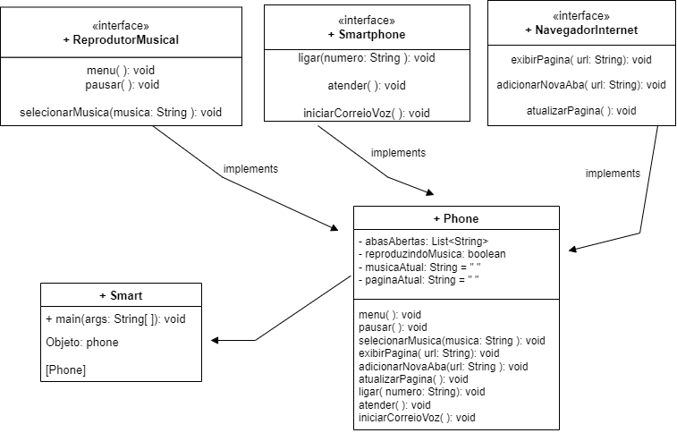

# Smartphone
## Programação orientada a objetos e modelagem UML

## Objetivos:

<ol>
    <li>Fazer a Modelagem e diagramação da representação em UML.</li>
    <li>Criar os arquivos necessários para mostrar o comportamento de um iPhone.</li>
</ol>

## Comportamentos esperados

<ol>
    <li>O Reprodutor musical deverá: tocar, pausar e selecionar música</li>
    <li>O aparelho telefônico deverá: ligar, atender e iniciar correio de voz</li>
    <li>Navegador na Internet deverá: exibir a página, adicionar nova aba e atualizar a página</li>
</ol>

## Representação UML

